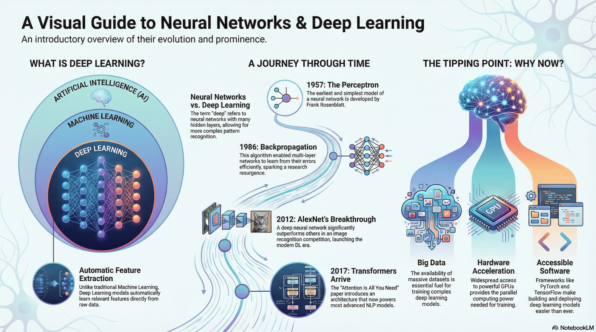

# 3.7 Neural Network and Deep Learning

## Lesson Overview

## Dependencies

Refer to the following markdown file for the respective sections of the class:

- [Self Studies](./studies.md)
- [Lesson](./lesson.md)
- [Assignment](./assignment.md)
- [Quiz](./quiz.md)
- [Reference](./reference.md)

## Lesson Objectives

At the end of the lesson, learners shall be able to:

- **Describe Perceptron and Multi-Layer Perceptron (MLP)** as the foundation of Neural Networks, explaining their architectural progression from single-layer linear classifiers to multi-layer systems capable of solving non-linear problems through activation functions and backpropagation.

- **Create and train a perceptron using NumPy** from scratch, coding the mathematical formulation of forward passes and weight updates to understand the core mechanics of neural learning without relying on high-level frameworks.

- **Build and train a Fully Connected Neural Network (MLP) using PyTorch**, leveraging the framework to construct a deep learning model, define loss functions and optimizers, and execute the training loop for classification tasks on datasets like MNIST.

## Lesson Plan

| Duration | What                    | How or Why                                                                       |
| -------- | ----------------------- | -------------------------------------------------------------------------------- |
| - 5mins  | Start zoom session      | So that learners can join early and start class on time.                         |
| 20 mins  | Activity                | Recap on self-study and prework materials.                                       |
| 40 mins  | Code-along              | Part 1: Introduction to Neural Networks and Deep Learning.                       |
|          | **1 HR MARK**           |
| 30 mins  | Code-along              | Part 2: Perceptron and MLP.                                                      |
| 10 mins  | Break                   |                                                                                  |
| 20 mins  | Code-along              | Part 3: Introduction to PyTorch.                                                 |
|          | **2 HR MARK**           |
| 50 mins  | Code-along              | Part 4: Building a Fully Connected Neural Network on MNIST and Titanic datasets. |
| 10 mins  | Briefing / Q&A          | Brief on references, assignment, quiz and Q&A.                                   |
|          | **END CLASS 3 HR MARK** |
